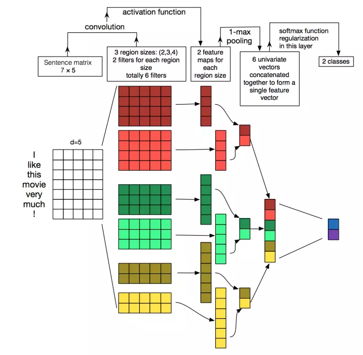

# 文本分类--CNN
# 1.TxetCNN数据预处理
## 1.1 词向量
打算自己训练词向量的同学，可以使用gensim，方便快捷，当然使用tensorflow来做也是可以的。下面是使用gensim训练词向量的代码。
```
#encoding=utf-8
from gensim.models.word2vec import Word2Vec
form gensim.models.word2vec import LineSentence

sentences = LineSentence('WordSeg.text_utf-8')
model = 
```
size是词向量的维度，sg=0,是用cbow进行训练，sg=1,使用sg进行训练。

# 1.2 文本分词
有了打标签的文本，接下来当然是要处理它了啊
```
def read_file(filename):
    '''中文分词：将中文句子分词词组
    '''
    re_han = re.compile(u"([\u4E00-\u9FD5a-zA-Z0-9+#&\._%]+)")  # the method of cutting text by punctuation
    contents, labels = [], []
    with codecs.open(filename, 'r', encoding='utf-8') as f:
        for line in f:
            try:
                line = line.rstrip()
                assert len(line.split('\t')) == 2   # 共有两列 第一列为标签，第二列为文本
                label, content = line.split('\t')
                labels.append(label)
                blocks = re_han.split(content)
                word = []
                for blk in blocks:
                    if re_han.match(blk):
                        word.extend(jieba.lcut(blk))
                contents.append(word)
            except:
                pass
    return labels, contents  #返回 标签 和 词组

```
这步的操作主要是对文本分词，然后得到文本列表，标签列表。举个🌰。

content=[['文本','分词'],['标签','列表']；label=['A','B']

## 1.3 建立词典，词典词向量
不能是个词我就要吧。那怎么办呢？去停用词！去了停用词之后，取文本(这个文本指的是所有文本，包括训练、测试、验证集)中前N个词，表示这N个词是比较重要的，然后保存。之前训练的词向量是个数据量很大集合。很多词，我已经不需要了，我只要这N个词的词向量。同样是上代码。
```
def built_vocab_vector(dataSet, filenames, voc_size = 10000):
    '''
    去停用词，得到前9999个词，获取对应的词 以及 词向量
    :param filenames:
    :param voc_size:
    :return:
    '''
    stopword_file = os.path.join(MEDIA_ROOT,os.path.normpath('data/cnn/stopwords.txt'))  # 中文停用词 共用

    stopword = open(stopword_file, 'r', encoding='utf-8')
    stop = [key.strip(' \n') for key in stopword]

    all_data = []
    j = 1
    embeddings = np.zeros([10000, 100])
    categories = []  # 类别

    for filename in filenames:
        labels, content = read_file(filename)  #在这里就开始分词了（read_file)
        if labels not in categories:
            categories.append(labels)

        for eachline in content:
            line =[]
            for i in range(len(eachline)):
                if str(eachline[i]) not in stop:#去停用词
                    line.append(eachline[i])
            all_data.extend(line)

    counter = Counter(all_data)
    count_paris = counter.most_common(voc_size-1)
    word, _ = list(zip(*count_paris))
    # f_file = os.path.join(MEDIA_ROOT, os.path.normpath('data/cnn/vector_word.txt'))  #产生训练集的词向量表文件
    f_file = os.path.join(MEDIA_ROOT, 'data','vector_word.txt')#  词向量
    dataSet.vector_word_filename = f_file
    f = codecs.open(f_file, 'r', encoding='utf-8')
    # vocab_word_file = os.path.join(MEDIA_ROOT, os.path.normpath('data/cnn/vocab_word.txt'))
    vocab_word_file = os.path.join(MEDIA_ROOT, 'data',str(dataSet.id)+'.vocab_word.txt')
    dataSet.vocab_filename = vocab_word_file
    vocab_word = open(vocab_word_file, 'w', encoding='utf-8')
    for ealine in f:
        item = ealine.split(' ')
        key = item[0]
        vec = np.array(item[1:], dtype='float32')
        if key in word:
            embeddings[j] = np.array(vec)
            vocab_word.write(key.strip('\r') + '\n')
            j += 1
    # np_file = os.path.join(MEDIA_ROOT, os.path.normpath('data/cnn/vector_word.npz'))
    np_file = os.path.join(MEDIA_ROOT, 'data',str(dataSet.id)+'.vector_word.npz')
    dataSet.vector_word_npz = np_file
    np.savez_compressed(np_file, embeddings=embeddings)

    return categories
```
我提取了文本的前9999个比较重要的词，并按顺序保存了下来。embeddings= np.zeros([10000, 100]) 表示我建立了一个10000个词，维度是100的词向量集合。然后将9999个词在大词向量中的数值，按1-9999的顺序，放入了新建的词向量中。第0项，让它保持是100个0的状态

## 1.4  建立词典
```
def get_wordid(filename):
    key = open(filename, 'r', encoding='utf-8')

    wordid = {}
    wordid['<PAD>'] = 0
    j = 1
    for w in key:
        w = w.strip('\n')
        w = w.strip('\r')
        wordid[w] = j
        j += 1
    return wordid
```
注意：词典里面词的顺序，要跟新建的词向量中词的顺序一致

## 1.5 标签词典
```

def read_category(categories):
    # categories = ['体育', '财经', '房产', '家居', '教育', '科技', '时尚', '时政', '游戏', '娱乐']  # 暂时写死
    cat_to_id = dict(zip(categories, range(len(categories))))
    return categories, cat_to_id
```
将标签也词典一下。

## 1.6 Padding的过程
padding是将所有句子进行等长处理，不够的在句子最后补0；将标签转换为one-hot编码。

```
def process(filename, word_to_id, cat_to_id, max_length=600):
    """
    Args:
        filename:train_filename or test_filename or val_filename
        word_to_id:get from def read_vocab()
        cat_to_id:get from def read_category()
        max_length:allow max length of sentence
    Returns:
        x_pad: sequence data from  preprocessing sentence
        y_pad: sequence data from preprocessing label

    """
    labels, contents = read_file(filename)
    data_id, label_id = [], []
    for i in range(len(contents)):
        data_id.append([word_to_id[x] for x in contents[i] if x in word_to_id])
        label_id.append(cat_to_id[labels[i]])
    x_pad = kr.preprocessing.sequence.pad_sequences(data_id, max_length, padding='post', truncating='post')
    y_pad = kr.utils.to_categorical(label_id)
    return x_pad, y_pad
```
首先将句子中的词，根据词典中的索引，变成全数字的形式；标签也进行同样处理。然后，根据max_length(句子最大长度)进行padding,得到x_pad,标签转换one-hot格式。好了，到这里文本的预处理，告一段落！
## 1.7 读取所需数据
我们保存了10000词的词向量，我们要读取它，还有处理的句子，我们也要分批，输入进模型。
```
def get_word2vec(filename):
    with np.load(filename) as data:
        return data["embeddings"]


def batch_iter(x, y, batch_size = 64):
    data_len = len(x)
    num_batch = int((data_len - 1)/batch_size) + 1
    indices = np.random.permutation(np.arange(data_len))
    '''
    np.arange(4) = [0,1,2,3]
    np.random.permutation([1, 4, 9, 12, 15]) = [15,  1,  9,  4, 12]
    '''
    x_shuff = x[indices]
    y_shuff = y[indices]
    for i in range(num_batch):
        start_id = i * batch_size
        end_id = min((i+1) * batch_size, data_len)
        yield x_shuff[start_id:end_id], y_shuff[start_id:end_id]
```
在代码里，我用一个例子，解释了np.random.permutation的作用。
# 2.tensorflow中的TextCNN
  
接下来开始搭建TextCNN在tensorflow中的实现
## 2.1 定义占位符
```
    def __init__(self, pm):
        # 需要往传pm
        self.pm = pm
        self.input_x = tf.placeholder(tf.int32, shape=[None, self.pm.seq_length], name='input_x')
        self.input_y = tf.placeholder(tf.float32, shape=[None, self.pm.num_classes], name='input_y')
        self.keep_pro = tf.placeholder(tf.float32, name='drop_out')
        self.global_step = tf.Variable(0, trainable=False, name='global_step')
        self.cnn()
```
## 2.2 embedding
```
        with tf.device('/cpu:0'), tf.name_scope('embedding'):
            self.embedding = tf.get_variable("embeddings", shape=[self.pm.vocab_size, self.pm.embedding_size],
                                             initializer=tf.constant_initializer(self.pm.pre_trianing))
            embedding_input = tf.nn.embedding_lookup(self.embedding, self.input_x)
            self.embedding_expand = tf.expand_dims(embedding_input,
                                                   -1)  # [None,seq_length,embedding_size,1] [None,600,100,1]
```
vocab_size:是词的个数，在这里是10000；  
embedding_size：是词向量尺寸，这里是100；  
embedding_lookup:我把它看成与excel vlookup类似的查找函数，是将embedding中的词向量根据input_x中的数字进行索引，然后填充。比如，input_x中的3，将input_x中的3用embedding中的第三行的100个数字进行填充，得到一个tensor:[batch_size,seq_length,embedding_size].  
因为，卷积神经网络中的，conv2d是需要4维张量的，故用tf.expand_dims在embedding_input最后再补一维。

## 3.3 卷积层
filte 高度设定为【2，3，4】三种，宽度与词向量等宽，卷积核数量设为num_filter。假设batch_size =1，即对一个句子进行卷积操作。每一种filter卷积后，结果输出为  
[1,seq_length - filter_size +1,1,num_filter]的tensor。再用ksize=[1,seq_length - filter_size + 1,1,1]进行max_pooling,得到[1,1,1,num_filter]这样的tensor.将得到的三种结果进行组合,得到[1,1,1,num_filter*3]的tensor.最后将结果变形一下[-1,num_filter*3]，目的是为了下面的全连接。再次有请代码
```
pooled_outputs = []
        for i, filter_size in enumerate(self.pm.kernel_size):
            with tf.name_scope("conv-maxpool-%s" % filter_size):
                filter_shape = [filter_size, self.pm.embedding_size, 1, self.pm.num_filters]  # [2,100,1,128]
                w = tf.Variable(tf.truncated_normal(filter_shape, stddev=0.1), name='w')  # 卷积核
                b = tf.Variable(tf.constant(0.1, shape=[self.pm.num_filters]), name='b')  # [128]
                conv = tf.nn.conv2d(self.embedding_expand, w, strides=[1, 1, 1, 1], padding='VALID',
                                    name='conv')  # [None,599,1,128]
                h = tf.nn.relu(tf.nn.bias_add(conv, b), name='relu')

                pooled = tf.nn.max_pool(h, ksize=[1, self.pm.seq_length - filter_size + 1, 1, 1], strides=[1, 1, 1, 1],
                                        padding='VALID', name='pool')  # 池化的参数很精妙   [None,1,1,128]
                pooled_outputs.append(pooled)

        num_filter_total = self.pm.num_filters * len(self.pm.kernel_size)  # 128 * 3
        self.h_pool = tf.concat(pooled_outputs, 3)
        self.h_pool_flat = tf.reshape(self.h_pool, [-1, num_filter_total])  # [None, 128 *3]
```
## 3.4  全连接层
在全连接层中进行dropout,通常保持率为0.5。其中num_classes为文本分类的类别数目。然后得到输出的结果scores，以及得到预测类别在标签词典中对应的数值predicitons
```
        with tf.name_scope('dropout'):
            self.h_drop = tf.nn.dropout(self.h_pool_flat, self.keep_pro)

        with tf.name_scope('output'):
            w = tf.get_variable("w", shape=[num_filter_total, self.pm.num_classes],
                                initializer=tf.contrib.layers.xavier_initializer())

            b = tf.Variable(tf.constant(0.1, shape=[self.pm.num_classes]), name='b')

            self.scores = tf.nn.xw_plus_b(self.h_drop, w, b, name='scores')
            self.pro = tf.nn.softmax(self.scores)  # 最大为1，其余为0
            self.predicitions = tf.argmax(self.pro, 1, name='predictions')
```

## 3.5 loss
这里使用softmax交叉熵求loss, logits=self.scores 这里一定用的是未经过softmax处理的数值。

```
        with tf.name_scope('loss'):
            losses = tf.nn.softmax_cross_entropy_with_logits(logits=self.scores, labels=self.input_y)
            self.loss = tf.reduce_mean(losses)  # 对交叉熵取均值非常有必要

```
## 3.6 optimizer
这里使用了梯度裁剪。首先计算梯度，这个计算是类似L2正则化计算w的值，也就是求平方再平方根。然后与设定的clip裁剪值进行比较，如果小于等于clip,梯度不变；如果大于clip,则梯度*（clip/梯度L2值）
```
        with tf.name_scope('optimizer'):
            # 退化学习率 learning_rate = lr*(0.9**(global_step/10);staircase=True表示每decay_steps更新梯度
            # learning_rate = tf.train.exponential_decay(self.config.lr, global_step=self.global_step,
            # decay_steps=10, decay_rate=self.config.lr_decay, staircase=True)
            # optimizer = tf.train.AdadeltaOptimizer(learning_rate)
            # self.optimizer = optimizer.minimize(self.loss, global_step=self.global_step) #global_step 自动+1
            # no.2
            optimizer = tf.train.AdamOptimizer(self.pm.lr)
            gradients, variables = zip(*optimizer.compute_gradients(self.loss))  # 计算变量梯度，得到梯度值,变量
            gradients, _ = tf.clip_by_global_norm(gradients, self.pm.clip)
            # 对g进行l2正则化计算，比较其与clip的值，如果l2后的值更大，让梯度*(clip/l2_g),得到新梯度
            self.optimizer = optimizer.apply_gradients(zip(gradients, variables),
                                                       global_step=self.global_step)  # global_step 自动+1
```
## 3.7 accuracy
最后，计算模型的准确度。

```
        with tf.name_scope('accuracy'):
            correct_predictions = tf.equal(self.predicitions, tf.argmax(self.input_y, 1))
            self.accuracy = tf.reduce_mean(tf.cast(correct_predictions, 'float32'), name='accuracy')
```
## 3.8 训练模型
```
def train(model, pm, wordid, cat_to_id, dataid):
    '''model: 是cnn对象'''

    tensorboard_dir = os.path.join(TENSORBOARD_DIR, 'text_cnn', make_dir_string(dataid, pm))
    save_dir = os.path.join(CHECKPOINTS, 'text_cnn', make_dir_string(dataid, pm))
    if not os.path.exists(tensorboard_dir):
        os.makedirs(tensorboard_dir)
    if not os.path.exists(save_dir):
        os.makedirs(save_dir)

    save_path = os.path.join(save_dir, 'best_validation')  # 在这里构建

    tf.summary.scalar("loss", model.loss)
    tf.summary.scalar("accuracy", model.accuracy)
    merged_summary = tf.summary.merge_all()
    writer = tf.summary.FileWriter(tensorboard_dir)
    saver = tf.train.Saver()
    session = tf.Session()
    session.run(tf.global_variables_initializer())
    writer.add_graph(session.graph)

    print("Loading Training data...")
    x_train, y_train = process(pm.train_filename, wordid, cat_to_id, pm.seq_length)
    x_val, y_val = process(pm.val_filename, wordid, cat_to_id, pm.seq_length)
    for epoch in range(pm.num_epochs):
        print('Epoch:', epoch + 1)
        num_batchs = int((len(x_train) - 1) / pm.batch_size) + 1
        batch_train = batch_iter(x_train, y_train, pm.batch_size)

        # 保存信息为pandas
        train_info = {"global_step": [], "loss": [], "accuracy": []}  # 训练信息

        for x_batch, y_batch in batch_train:
            feed_dict = model.feed_data(x_batch, y_batch, pm.keep_prob)
            _, global_step, train_summary, train_loss, train_accuracy = session.run(
                [model.optimizer, model.global_step, merged_summary, model.loss, model.accuracy], feed_dict=feed_dict)
            train_info["global_step"].append(global_step)
            train_info["loss"].append(train_loss)
            train_info["accuracy"].append(train_accuracy)

            if global_step % 100 == 0:
                val_loss, val_accuracy = model.evaluate(session, x_val, y_val)
                print(global_step, train_loss, train_accuracy, val_loss, val_accuracy)

            if (global_step + 1) % num_batchs == 0:
                print("Saving model...")
                save_info(os.path.join(tensorboard_dir, "train_info.csv"), train_info)
                del train_info
                train_info = {"global_step": [], "loss": [], "accuracy": []}
                saver.save(session, save_path, global_step=global_step)

        pm.lr *= pm.lr_decay
```

模型迭代次数为5，每完成一轮迭代，模型保存一次。当global_step为100的整数倍时，输出模型的训练结果以及在测试集上的测试结果。
